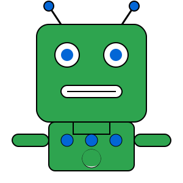

# Stan de GitHub Agent

Een interactieve Streamlit webapplicatie die een klikbare robot weergeeft met grappige uitspraken over wat een GitHub Agent allemaal kan doen. Bij elke klik op de robot verschijnt een nieuwe, willekeurige uitspraak. De applicatie is ontworpen om op een speelse manier de mogelijkheden van een GitHub Agent te demonstreren.



## Features

- 🤖 Interactieve robot die reageert op muisklikken
- 💬 Meer dan 15 grappige uitspraken over GitHub Agents
- 🎮 Geen herhalingen van uitspraken direct na elkaar
- 🎨 Aantrekkelijke styling met animaties en hover-effecten
- 📱 Responsief ontwerp dat werkt op verschillende schermgroottes
- 🔄 Reset-knop om opnieuw te beginnen

## Installatie

### Vereisten

- Python 3.8 of hoger
- pip (Python package manager)

### Stappen

1. **Clone de repository**

   ```bash
   git clone https://github.com/Fbeunder/GitHubAgent2.git
   cd GitHubAgent2
   ```

2. **Maak een virtuele omgeving (optioneel, maar aanbevolen)**

   ```bash
   python -m venv venv
   
   # Op Windows
   venv\Scripts\activate
   
   # Op macOS/Linux
   source venv/bin/activate
   ```

3. **Installeer de benodigde packages**

   ```bash
   pip install -r requirements.txt
   ```

## Gebruik

1. **Start de applicatie**

   ```bash
   streamlit run app.py
   ```

2. **Interactie met de applicatie**

   - De applicatie opent automatisch in je standaard webbrowser op `http://localhost:8501`
   - Klik op de robot om een grappige uitspraak te zien
   - Gebruik de reset-knop onderaan om opnieuw te beginnen

## Projectstructuur

```
GitHubAgent2/
├── app.py               # Hoofdapplicatie en Streamlit interface
├── robot_display.py     # Module voor het weergeven van de robot
├── quote_generator.py   # Module voor het genereren van uitspraken
├── styles.py            # Module voor CSS-styling
├── constants.py         # Module voor constanten (uitspraken, kleuren, etc.)
├── requirements.txt     # Package dependencies
├── assets/              # Directory voor statische bestanden
│   └── robot.svg        # SVG afbeelding van de robot
└── README.md            # Project documentatie
```

## Ontwikkeling

### Modules

- **constants.py**: Bevat alle constanten zoals de lijst met uitspraken, paden naar assets, en kleuren
- **robot_display.py**: Verantwoordelijk voor het weergeven van de robot afbeelding
- **quote_generator.py**: Genereert willekeurige uitspraken zonder directe herhalingen
- **styles.py**: Definieert CSS-stijlen voor de applicatie
- **app.py**: Hoofdmodule die alles samenvoegt tot een werkende applicatie

### Uitbreiding

Je kunt de applicatie op verschillende manieren uitbreiden:

- Voeg meer uitspraken toe aan de `QUOTES` lijst in `constants.py`
- Maak nieuwe designs voor de robot in de assets directory
- Voeg extra interacties of animaties toe
- Implementeer een themaswitch voor lichte/donkere modus

## Bijdragen

Bijdragen aan dit project zijn welkom! Volg deze stappen:

1. Fork de repository
2. Maak een nieuwe branch (`git checkout -b feature/jouw-feature`)
3. Commit je wijzigingen (`git commit -m 'Voeg een nieuwe feature toe'`)
4. Push naar de branch (`git push origin feature/jouw-feature`)
5. Open een Pull Request

## Licentie

Dit project is gelicenseerd onder de MIT License - zie het LICENSE bestand voor details.

## Credits

- Ontwikkeld door [Fbeunder](https://github.com/Fbeunder)
- Robot SVG ontworpen door het team
- Gemaakt met [Streamlit](https://streamlit.io/)
